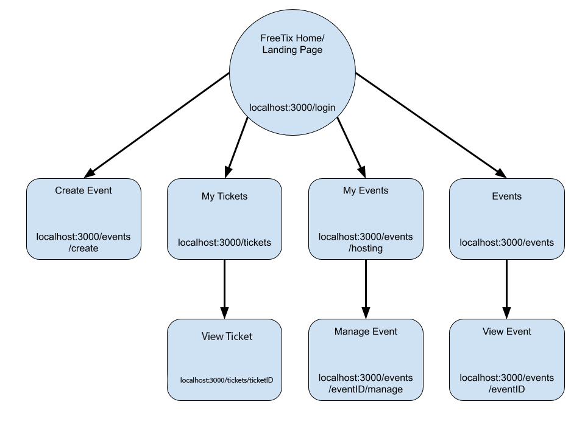

# FreeTix

## Overview

Tired of paying fees when buying tickets for your favorite concert or event? Look no further because FreeTix is here for you.

FreeTix is a commission free event management and ticketing web app that is designed for both event planners and event go-ers that allow users to plan events, sell and buy tickets, as well as search for events in their cities. Each user (through registration and login authentication) is able to manage their own events and view all the tickets that they have purchased.


## Data Model

The application will store Users, Events, and Tickets

* users can manage multiple events (each event tagged to the user by a reference)
* each event can have multiple tickets (each ticket tagged to an event by a reference)
* users can have multiple tickets (each ticket is tagged to a user by a reference)

An Example User:

```javascript
{
  username: "timzhou99",
  hash: // a password hash,
  
  events: // an array of references to Event documents
  tickets: //an array of references to Ticket documents
  
  userCity: "New York",
  userState: "New York"
}
```

An Example Event with a List of Ticket IDs:

```javascript
{
  eventManager: // a reference to a User object
  
  eventName: "Travis Scott Concert",
  eventDescription: "The best event of the month!",
  eventPicture: "link.to.image.com",
  eventActive: true,
  
  eventDate: //DateObject
  eventTimeStart: //time the event starts
  eventTimeEnd: //time the event ends
  
  eventAddress: "40 W 4th Street",
  eventCity: "New York",
  eventState: "New York",

  maxQuantity: 500,
  currentQuantity: 346,
  tickets: [
    { ticketID: "UNIQUE KEY", ticketType: "General Admission", ticketValue: 150.00},
    { ticketID: "UNIQUE KEY", ticketType: "VIP Admission", ticketValue: 350.00},
  ],
  
  eventID: "UNIQUE KEY"
}
```

An Example Ticket:

```javascript
{
  ticketHolder: // a reference to a User object
  eventID: "UNIQUE KEY",
  
  ticketType: "General Admission",
  ticketValue: 150.00,
  ticketStatus: "Cancelled",
  
  createdAt: // timestamp
  ticketID: "UNIQUE KEY"
}
```

## [Link to Commented First Draft Schema](db.js) 

## Wireframes

/events/create - page for creating a new event


/events/eventID/manage - page for managing an existing event


/events/hosting - page to view and manage all events the user is hosting


/events/eventID - page for viewing the details of an event and option to purchase a ticket


/events - page for showing all events and the ability to filter them


/tickets/ticketID - page for viewing the details of an existing ticket and option to cancel it


/tickets - page for showing all tickets


## Site map



## User Stories

1. as non-registered user, I can register a new account with the site
2. as a user, I can log in to the site
3. as a user, I can create a new event
4. as a user, I can modify an existing event
5. as a user, I can view all of the events I've created in a single list
6. as a user, I can view all of the tickets I've purchased in a single list
7. as a user, I can view all of the events in my area or in the United States
8. as a user, I can purchase a ticket
9. as a user, I can cancel my ticket
10. as a user, I can view my ticket

## Research Topics

* (5 points) Integrate user authentication
    * I'm going to be using passport for user authentication
    * And account has been made for testing; I'll email you the password
    * see <code>cs.nyu.edu/~jversoza/ait-final/register</code> for register page
    * see <code>cs.nyu.edu/~jversoza/ait-final/login</code> for login page
* (4 points) Perform client side form validation using a JavaScript library
    * see <code>cs.nyu.edu/~jversoza/ait-final/my-form</code>
    * if you put in a number that's greater than 5, an error message will appear in the dom
* (5 points) vue.js
    * used vue.js as the frontend framework; it's a challenging library to learn, so I've assigned it 5 points

10 points total out of 8 required points

## [Link to Initial Main Project File](app.js) 

## Annotations / References Used

1. [passport.js authentication docs](http://passportjs.org/docs) - (add link to source code that was based on this)
2. [tutorial on vue.js](https://vuejs.org/v2/guide/) - (add link to source code that was based on this)

